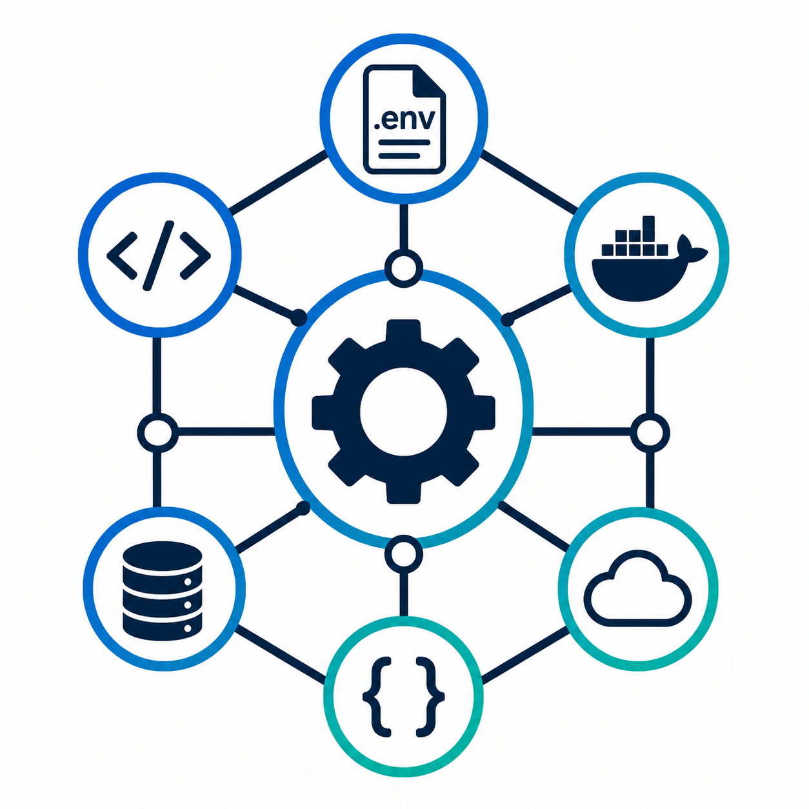

<div align="center">

<picture>
  
</picture>

# EnvGraph

**Visualize how configuration flows through your application.**

[](https://github.com/PeacexF/EnvGraph/actions/workflows/ci.yml)

[](https://go.dev/)
[](https://www.typescriptlang.org/)
[](https://www.docker.com/)

[](#)
[](#)


</div>

---

EnvGraph is a developer tool that analyzes project configuration and generates an interactive graph showing where environment variables come from and where they are used.

Modern applications spread configuration across many places:

- `.env` files
- Docker Compose
- source code
- deployment files
- CI/CD configuration

EnvGraph helps answer:

- Where does this environment variable come from?
- Where is it passed?
- Which part of the application uses it?
- Which configuration values are missing or unused?

---

## Example

Instead of manually searching:

```bash
grep -R DATABASE_URL .
````

EnvGraph creates a visual flow:

```
.env

DATABASE_URL
      |
      v

docker-compose.yml

      |
      v

api container

      |
      v

config/database.go

      |
      v

PostgreSQL connection
```

---

# Features

## Configuration Flow Analysis

Detect relationships between:

* configuration files
* containers
* environment variables
* application code

---

## Interactive Graph

Explore your project's configuration structure visually.

Understand:

* sources
* consumers
* dependencies
* configuration flow

---

## Missing Configuration Detection

Find variables that are used but not provided.

Example:

```
JWT_SECRET

Used in:
auth/config.go

Source:
missing
```

---

## Unused Configuration Detection

Identify configuration values that exist but are never used.

Example:

```
OLD_API_KEY

Defined in:
.env

Usage:
none
```

---

# Supported Sources

| Source                    | Status      | Detects                                        |
| ------------------------- | ----------- | ---------------------------------------------- |
| `.env` files              | Supported   | assignments, quoting, multi-line values         |
| Docker Compose            | Supported   | `environment`, `env_file`, `${VAR}` substitution |
| Go environment access     | Supported   | `os.Getenv`, `os.LookupEnv`                     |
| Python environment access | Supported   | `os.getenv`, `os.environ[...]`, `environ.get`   |
| Dockerfile                | Planned     |                                                |
| GitHub Actions            | Planned     |                                                |
| Kubernetes manifests      | Planned     |                                                |

More sources will be added gradually.

---

# Installation

```bash
go install github.com/PeacexF/EnvGraph/cmd/envgraph@latest
```

Or build from a checkout:

```bash
go build -o envgraph ./cmd/envgraph
```

---

# Usage

Analyze a project and print its configuration flow:

```bash
envgraph scan .
```

```
DATABASE_URL  ok
  source     .env:2
  passed to  api (docker-compose.yml:5)
  used in    config/database.go:7
```

Fail when configuration is missing, which makes it usable as a CI step:

```bash
envgraph check .
```

Exits with status `1` when a variable is used but never provided. Pass
`--strict` to fail on unused variables too.

Explore it in a browser:

```bash
envgraph serve .
```

Opens an interactive graph on `http://127.0.0.1:8080`. Click a node to see
where a variable comes from and where it goes; filter to missing or unused.
The project is re-scanned on every request, so a reload picks up your edits.

Write the graph as JSON:

```bash
envgraph export .            # writes graph.json
envgraph scan . -f json      # the analysis and the graph together
```

Useful flags:

| Flag              | Effect                                            |
| ----------------- | ------------------------------------------------- |
| `--exclude <dir>` | skip additional directories                       |
| `--include-tests` | count usage in test files                         |
| `--show-values`   | include assigned values (these are often secrets) |
| `-o <file>`       | write to a file instead of stdout                 |

Try it against the bundled examples:

```bash
envgraph scan examples/simple-go
envgraph check examples/compose-python
```

---

# How variables are resolved

A variable is **missing** when nothing supplies a value for it. What counts
as supplying a value is deliberately strict:

| Written as                          | Counts as a source? |
| ----------------------------------- | ------------------- |
| `DATABASE_URL=postgres://...` in `.env` | yes             |
| `LOG_LEVEL: info` in compose        | yes                 |
| `PORT: ${PORT:-8080}` in compose    | yes, via the fallback |
| `DATABASE_URL: ${DATABASE_URL}`     | no — it passes a value along without supplying one |
| `- DATABASE_URL` in compose         | no — it forwards a host variable |

`DB_HOST: ${POSTGRES_HOST}` renames a variable on the way into a container.
`DB_HOST` is treated as supplied exactly when `POSTGRES_HOST` is.

A variable is **unused** when it has a source but nothing reads it — neither
application code nor a container it is passed to.

---

# Architecture

EnvGraph consists of three main parts:

```
                CLI

                 |

              Scanner

                 |

            Graph Engine

                 |

             Web Viewer
```

### Scanner

Finds configuration sources and consumers.

### Graph Engine

Builds relationships between configuration nodes.

### Web Viewer

Displays the configuration flow interactively. Built from plain ES modules
with a vendored Cytoscape.js, compiled into the binary with `go:embed`, so
`go build` remains the only build step and there is nothing to install.

---

# Why EnvGraph?

Configuration is one of the hidden complexities of modern applications.

A project may have:

```
.env
docker-compose.yml
application config
source code
CI variables
```

but no clear overview of how values move through the system.

EnvGraph provides that missing layer of visibility.

---

# Contributing

Contributions are welcome.

Please read [CONTRIBUTING.md](CONTRIBUTING.md) before submitting changes.

---

# License

[MIT](LICENSE)
